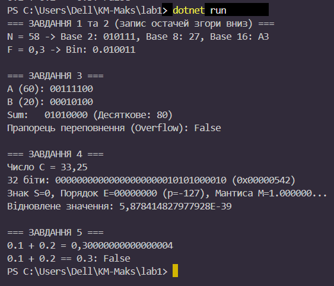

# Звіт
## Вхідні дані
N = 58 (ціле число)
F = 0.3 (дріб)
A = 60, В = 20 (числа для додавання)
C = 33.25 (число у форматі IEEE 754)
## Крок 1. Ручні розрахунки
### 1. Переведення цілого числа N = 58
У двійкову систему (q = 2):
58 / 2 = 29 (остача 0);
29 / 2 = 14 (остача 1);
14 / 2 = 7 (остача 0);
7 / 2 = 3 (остача 1);
3 / 2 = 1 (остача 1);
1 / 2 = 0 (остача 1);
Результат: 010111

У вісімкову систему (q = 8):
58 / 8 = 7 (остача 2);
7 / 8 = 0 (остача 7);
Результат: 27 

У шістнадцяткову систему (q = 16):
58 / 16 = 3 (остача 10 позначаємо А);
3 / 16 = 0 (остача 3);
Результат: А3
### 2. Переведення дробу F = 0.3 у двійкову систему (6 розрядів після коми)
0.3 * 2 = 0.6 (ціла частина 0);
0.6 * 2 = 1.2 (ціла частина 1, залишок 0.2) - початок періоду;
0.2 * 2 = 0.4 (ціла частина 0);
0.4 * 2 = 0.8 (ціла частина 0);
0.8 * 2 = 1.6 (ціла частина 1, залишок 0.6);
0.6 * 2 = 1.2 (повторення кроку 2, залишок 0.2) - повторення періоду;
Результат:010011

### 3 
A (60): 00111100
B (20): 00010100
Sum: 01010000 (Десяткове: 80)
Прапорець переповнення (Overflow): False

### 4
Число C = 33.25
32 біти: 01000010000001010000000000000000 (0x42050000)
Знак S=0, Порядок E=10000100 (p=5), Мантиса M=1.000010...
Відновлене значення: 33.25

### 5
0.1 + 0.2 = 0.30000000000000004
0.1 + 0.2 = 0.3: False

### Результат коду

