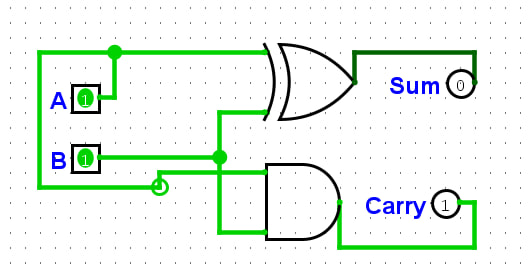
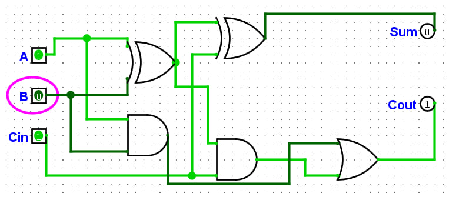
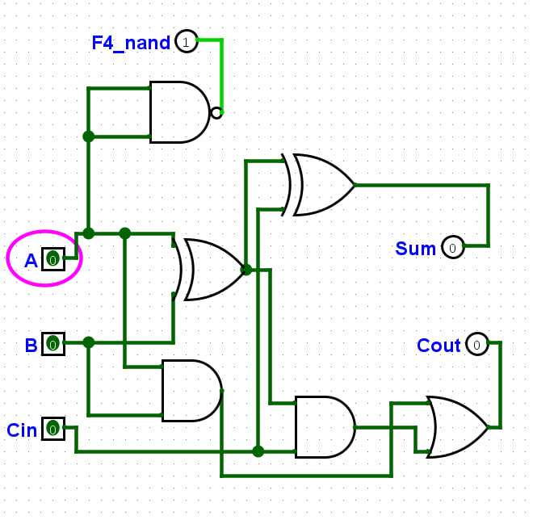
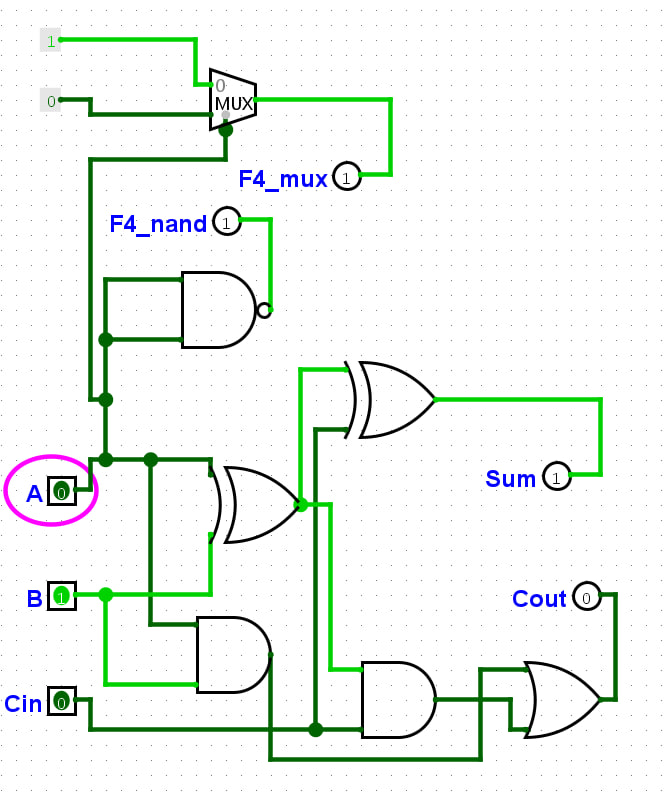
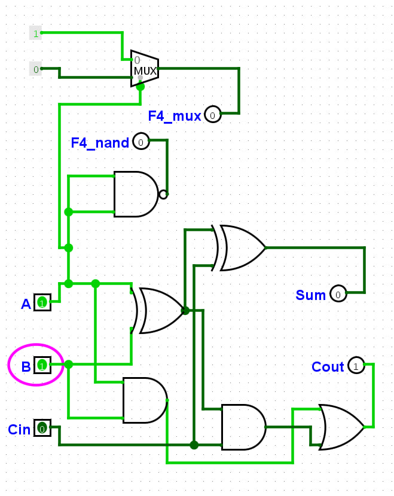

# Звіт з практичної роботи №2

**Тема:** Синтез комбінаційних схем  
**Дисципліна:** Комп’ютерні та мікропроцесорні системи  
**Варіант:** 4 (набори $F=1$: 0, 1)  

---

## Мета роботи
Навчитися будувати й перевіряти за допомогою таблиць істинності базові комбінаційні вузли (півсуматор, повний суматор, мультиплексор 2-в-1) та синтезувати комбінаційні схеми за заданою логічною функцією двох змінних у Logisim Evolution.

---

## 1. Півсуматор (Half Adder)
Півсуматор додає два однорозрядні числа $A$ та $B$.
* **Рівняння:**
  * Сума: $Sum = A \oplus B$ (елемент XOR)
  * Перенос: $Carry = A \land B$ (елемент AND)

[Схема півсуматора](./screens/half_adder.png)

### Таблиця істинності:
| $A$ | $B$ | $Sum$ | $Carry$ |
| :---: | :---: | :---: | :---: |
| 0 | 0 | 0 | 0 |
| 0 | 1 | 1 | 0 |
| 1 | 0 | 1 | 0 |
| 1 | 1 | 0 | 1 |

---

## 2. Повний суматор (Full Adder)
Повний суматор додає два біти $A$, $B$ та враховує вхідний перенос $C_{in}$ із молодшого розряду. Зібраний із двох півсуматорів та вентиля OR.
* **Рівняння:**
  * $Sum = A \oplus B \oplus C_{in}$
  * $C_{out} = (A \land B) \lor (C_{in} \land (A \oplus B))$

[Схема повного суматора](./screens/full_adder.png)

### Таблиця істинності:
| $A$ | $B$ | $C_{in}$ | $Sum$ | $C_{out}$ |
| :---: | :---: | :---: | :---: | :---: |
| 0 | 0 | 0 | 0 | 0 |
| 0 | 0 | 1 | 1 | 0 |
| 0 | 1 | 0 | 1 | 0 |
| 0 | 1 | 1 | 0 | 1 |
| 1 | 0 | 0 | 1 | 0 |
| 1 | 0 | 1 | 0 | 1 |
| 1 | 1 | 0 | 0 | 1 |
| 1 | 1 | 1 | 1 | 1 |

---

## 3. Мультиплексор 2-в-1 (на вентелях)
Зібрано мультиплексор 2-в-1 на базових вентилях AND, OR, NOT (без використання готового блоку з бібліотеки Plexers).
* **Адресна лінія $S$:** при $S=0$ на вихід $Out$ передається вхід $D_0$, при $S=1$ — вхід $D_1$.
* **Формула:** $Out = (D_0 \land \bar{S}) \lor (D_1 \land S)$

[Схема мультиплексора 2-в-1](./screens/mux_2to1.png)

---

## 4. Синтез схеми за Варіантом 4

### Вихідні дані:
Функція дорівнює одиниці на наборах 0 та 1 (комбінації $AB = 00$ та $AB = 01$).

### Таблиця істинності:
| Набір ($AB$) | $A$ | $B$ | $F_4$ |
| :---: | :---: | :---: | :---: |
| 0 | 0 | 0 | **1** |
| 1 | 0 | 1 | **1** |
| 2 | 1 | 0 | 0 |
| 3 | 1 | 1 | 0 |

### Запис ДДНФ:
$$F_4 = (\bar{A} \land \bar{B}) \lor (\bar{A} \land B)$$

### Спрощення (алгебра Буля):
$$F_4 = \bar{A} \land (\bar{B} \lor B) = \bar{A} \land 1 = \bar{A}$$

[Схема за Варіантом 4](./screens/variant_4.png)

* **Опис схеми:** Для реалізації канонічної форми використано 2 інвертори NOT, 2 вентилі AND та 1 вентиль OR. Після перевірки виявилося, що вихід повністю відповідає інвертованому значення входу $A$ ($\bar{A}$).

---

## Відповіді на контрольні запитання

1. **З яких вентилів складається півсуматор і чому для суми використовують саме XOR ($A \oplus B$)?**  
   Півсуматор складається з вентилів XOR (для обчислення суми) та AND (для обчислення переносу). Вентиль XOR дає одиницю тільки тоді, коли один із входів дорівнює 1 ($0+1=1$, $1+0=1$), а при $1+1$ дає 0 (і 1 іде в перенос), що чітко відповідає правилам двійкового додавання.

2. **Чим повний суматор відрізняється від півсуматора і навіщо потрібен вхід $C_{in}$?**  
   Півсуматор додає лише два однорозрядні числа, а повний суматор має додатковий вхід $C_{in}$ (вхідний перенос з молодшого розряду). Це дозволяє об'єднувати суматори в ланцюжки для додавання багаторозрядних чисел.

3. **Скільки адресних ліній потрібно мультиплексору, щоб обрати один із чотирьох входів?**  
   Потрібно **2 адресні лінії**, оскільки $2^2 = 4$ можливі комбінації сигналів керування.

4. **Опишіть послідовність кроків синтезу комбінаційної схеми за таблицею істинності через ДДНФ.**  
   * Скласти таблицю істинності функції.  
   * Виписати кон'юнкції (AND) для всіх рядків, де функція дорівнює 1 (змінну зі значенням 0 беруть із запереченням NOT, зі значенням 1 - без).  
   * Об'єднати всі отримані кон'юнкції операцією диз'юнкції (OR) - отримати ДДНФ.  
   * Побудувати схему за отриманим виразом у Logisim.

5. **Чим у стандартах ANSI та ДСТУ/IEC позначають інверсію виходу?**  
   В обох стандартах інверсію виходу позначають **маленьким кружечком** на вихідній лінії вентиля (або скісною рискою/трикутником на межі блоку).

---

## Висновок
Під час практичної роботи №2 у Logisim Evolution було зібрано та протестовано базові комбінаційні вузли: півсуматор, повний суматор та мультиплексор 2-в-1 на базових елементах. Для Варіанта 4 складено таблицю істинності, записано ДДНФ та побудовано відповідну логічну схему. Перевірка за допомогою Poke Tool підтвердила повний збіг роботи зібраної схеми з таблицею істинності.