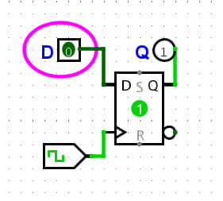
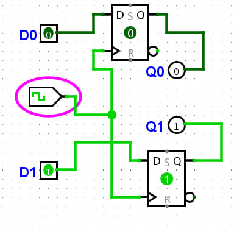
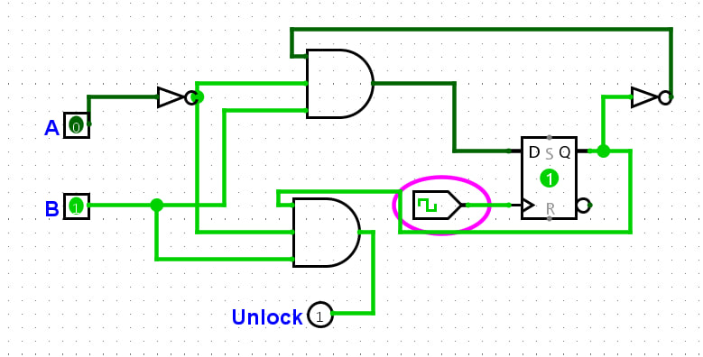

# Звіт з практичної роботи №3

**Тема:** Дослідження D-тригерів, паралельних регістрів та скінченних автоматів  
**Дисципліна:** Комп’ютерні та мікропроцесорні системи  
**Варіант:** 4 (код замка: **B, B**)  

---

## 1. Дослідження D-тригера
У Logisim Evolution зібрано схему з D-тригером, входом D, тактовою кнопкою Clock та виходом Q.

[Схема D-тригера](./screens/d_trigger.png)

* Зміна стану D без натискання Clock не впливає на вихід Q.
* Запис значення з входу D у тригер відбувається тільки в момент подачі тактового імпульсу (фронту).

---

## 2. 2-розрядний паралельний регістр
Складено регістр з двох D-тригерів із спільним тактовим входом Clock.

[Схема 2-розрядного регістра](./screens/register_2bit.png)

* Схема дозволяє одночасно записати 2 біти даних ($D_0, D_1$) за один такт.
* Записані значення зберігаються на виходах $Q_0, Q_1$ до наступного імпульсу Clock.

---

## 3. Синтез автомата кодового замка (Код: B, B)
Автомат відкривається після послідовного введення двох правильних символів **B, B**.

### Стани автомата:
* $S_0$ ($Q=0$) - заблоковано (початковий стан).
* $S_1$ ($Q=1$) - введено перший правильний символ **B**.
* $S_2$ - введено другий правильний символ **B** ($Unlock=1$).

### Таблиця переходів:

| Стан $Q$ | Вхід $A$ | Вхід $B$ | Вхід $D$ ($Q_{next}$) | Вихід $Unlock$ | Пояснення |
| :---: | :---: | :---: | :---: | :---: | :--- |
| 0 ($S_0$) | 0 | 0 | 0 | 0 | Очікування |
| **0 ($S_0$)** | **0** | **1** | **1 ($S_1$)** | **0** | **Перша B вірна** |
| 0 ($S_0$) | 1 | 0 | 0 | 0 | Помилка (символ A) |
| 1 ($S_1$) | 0 | 0 | 0 | 0 | Скидання (немає вводу) |
| **1 ($S_1$)** | **0** | **1** | **0 ($S_0$)** | **1 ($S_2$)** | **Друга B вірна $\rightarrow$ Замок відкрито** |
| 1 ($S_1$) | 1 | 0 | 0 | 0 | Помилка (символ A) |

### Логічні формули:
* **Для входу D:** $D = \bar{Q} \cdot \bar{A} \cdot B$
* **Для виходу Unlock:** $Unlock = Q \cdot \bar{A} \cdot B$

---

## 4. Реалізація у Logisim Evolution
Схему зібрано на одному D-тригері та двох елементах AND на 3 входи:

[Схема автомата кодового замка](./screens/fsm_lock.png)

* **Верхній AND (вхід D):** подано $\bar{Q}$ (через NOT з Q), $\bar{A}$ (через NOT з A) та $B$ напряму.
* **Нижній AND (вихід Unlock):** подано $Q$ напряму, $\bar{A}$ (через NOT з A) та $B$ напряму.

---

## 5. Перевірка роботи
* При введенні `A=0, B=1` і натисканні Clock тригер переходить у стан $Q=1$.
* При повторному `A=0, B=1` загоряється вихід $Unlock=1$.
* Будь-яке введення `A=1` скидає тригер у початковий стан $S_0$.

---

## Висновок
Під час роботи досліджено роботу D-тригера та 2-розрядного регістра. Побудовано автомат кодового замка для Варіанта 4 (код `B, B`). Симуляція в Logisim повністю підтвердила правильність логічних формул та таблиці переходів: замок спрацьовує чітко на послідовність `B, B`, а будь-яка помилка скидає схему в початковий стан.