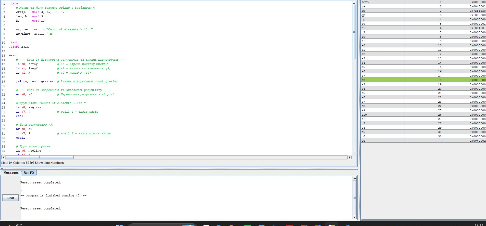
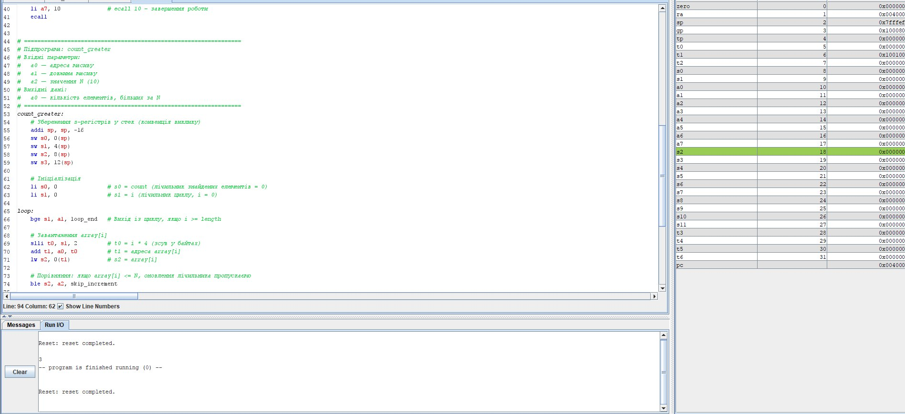
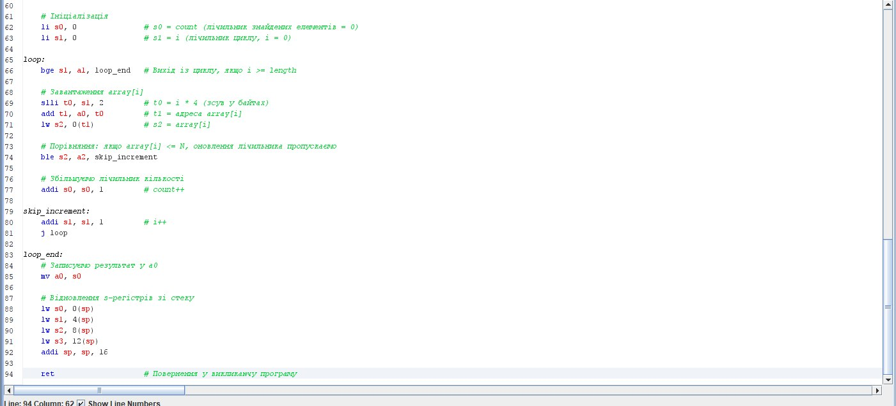
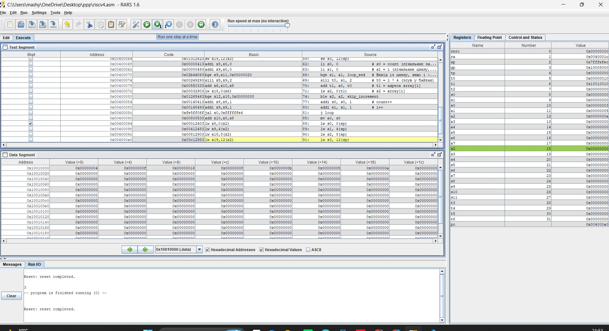

# ЗВІТ з практичного заняття №4

на тему: «Асемблер RISC-V: арифметика, розгалуження, цикли, підпрограми»

Варіант: №4

Завдання: Кількість елементів, більших за N=10

Масив для перевірки: 4, 15, 22, 8, 11

Очікуваний результат: 3

---

### 1. Текст програми 

### 2. Результат виконання програми та консольне виведення

Програму успішно зкомпільовано та виконано в середовищі RARS 1.6. У консолі Run I/O отримано очікуване значення `3`.

### 3. Ручний розрахунок для масиву варіанта

Вхідні дані: array = [4, 15, 22, 8, 11], length = 5, N = 10

1. Ініціалізація: count = 0.

2. Ітерація 1 ($i = 0$): array[0] = 4.
* Порівняння: $4 \le 10 \rightarrow$ умова не виконується, count = 0.

3. Ітерація 2 ($i = 1$): array[1] = 15.
* Порівняння: $15 > 10 \rightarrow$ виконується, count = 1.

4. Ітерація 3 ($i = 2$): array[2] = 22.
* Порівняння: $22 > 10 \rightarrow$ виконується, count = 2.

5. Ітерація 4 ($i = 3$): array[3] = 8.
* Порівняння: $8 \le 10 \rightarrow$ умова не виконується, count = 2.

6. Ітерація 5 ($i = 4$): array[4] = 11.
* Порівняння: $11 > 10 \rightarrow$ виконується, count = 3.

7. Завершення ($i = 5$): $5 \ge 5 \rightarrow$ вихід із циклу.
* Підсумковий результат: 3.

Ручний розрахунок повністю збігається з виводом консолі RARS (`3`).

---

### 4. Фіксація регістрів на трьох кроках виконання (Крок 5)

Для покрокового аналізу зафіксовано значення регістрів у середовищі RARS за допомогою точки зупинки (Breakpoint) на інструкції підпрограми lw s3, 12(sp):

Значення регістрів під час виконання:

| Назва регістру | Позначення | Значення (HEX) | Значення (Dec) | Пояснення / Роль у підпрограмі |
| --- | --- | --- | --- | --- |
| `a0` | x10 | `0x00000003`  | `3` | Результат підпрограми (знайдена кількість елементів $>10$)

 |
| `a1` | x11 | 0x00000005`  | `5 | Довжина масиву (`length`)

 |
| `a2` | x12 | 0x0000000a`  | `10 | Граничне значення ($N=10$)

 |
| `s0` | x8 | 0x00000003`  | `3 | Поточний лічильник кількості під час циклу |
| `s1` | x9 | 0x00000005`  | `5 | Лічильник ітерацій циклу ($i = 5$, вихід з циклу) |
| `s2` | x18 | 0x0000000b`  | `11 | Останній оброблений елемент масиву (`array[4] = 11`)

 |
| `ra` | x1 | `0x0040001c`  | - | Адреса повернення в головну програму `main`  |
| `sp` | x2 | `0x7fffefec`  | - | Вказівник стеку (виділено місце під $s$-регістри)

 |

---

### 5. Висновок про роль ra і `s`-регістрів

* Регістр `ra` (Return Address): слугує для збереження адреси повернення під час виконання інструкції jal. Завдяки цьому підпрограма знає, у яку точку головної програми повертатися після виконання інструкції ret (`jr ra`). Якщо підпрограма викликає іншу підпрограму, значення ra потрібно обов'язково зберігати у стеку, щоб не втратити точку повернення.

* Регістри `s0`–`s11` (Saved registers): згідно з конвенцією передачі параметрів RISC-V, ці регістри зберігають свої значення між викликами підпрограм. Якщо підпрограма використовує `s`-регістри для власних обчислень, вона зобов'язана зберегти їхні початкові значення у стек на початку (`sw`) і відновити зі стеку перед виходом (`lw`), гарантуючи недоторканність даних викликаючої програми.