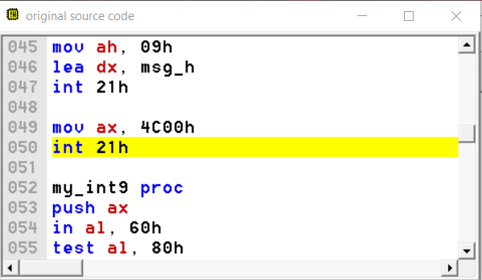
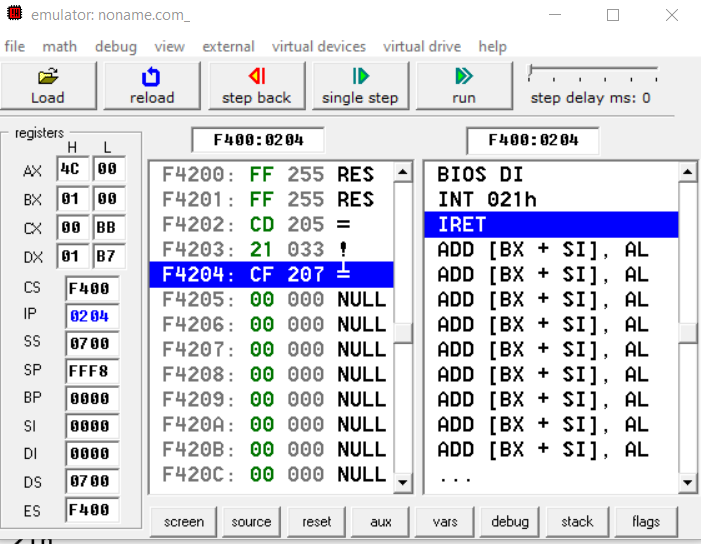
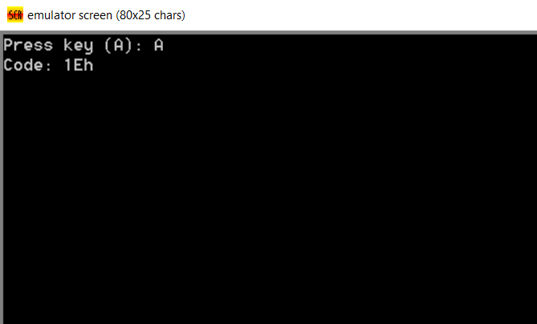

# Звіт з практичної роботи №5

**Тема:** Переривання клавіатури INT 9h та ввід-вивід в Emu8086  
**Варіант:** №4 (Отримання скан-коду клавіші в HEX)  

## Мета роботи
Навчитися перехоплювати апаратне переривання клавіатури `INT 9h`, зчитувати скан-код натиснутої клавіші та відновлювати системний вектор.

```

---

## 1. Код програми

```assembly
.model tiny
.code
org 100h

start:
    mov ah, 09h
    lea dx, msg_start
    int 21h

    mov ax, 3509h
    int 21h
    mov word ptr cs:[old_int9], bx
    mov word ptr cs:[old_int9+2], es

    cli
    mov ax, 2509h
    lea dx, my_int9
    int 21h
    sti

    mov ah, 00h
    int 16h
    mov cs:[last_scancode], ah

    mov dl, al
    mov ah, 02h
    int 21h

    cli
    mov ax, 2509h
    lds dx, cs:[old_int9]
    int 21h
    sti

    push cs
    pop ds

    mov ah, 09h
    lea dx, msg_res
    int 21h

    mov al, cs:[last_scancode]
    call print_hex_byte

    mov ah, 09h
    lea dx, msg_h
    int 21h

    mov ax, 4C00h
    int 21h

my_int9 proc
    push ax
    in al, 60h
    test al, 80h
    jnz skip_save
    mov cs:[last_scancode], al
skip_save:
    pop ax
    jmp dword ptr cs:[old_int9]
my_int9 endp

print_hex_byte proc
    push ax
    push bx
    push dx

    mov bl, al
    
    shr al, 4
    cmp al, 9
    jbe hex_num1
    add al, 7
hex_num1:
    add al, '0'
    mov dl, al
    mov ah, 02h
    int 21h

    mov al, bl
    and al, 0Fh
    cmp al, 9
    jbe hex_num2
    add al, 7
hex_num2:
    add al, '0'
    mov dl, al
    mov ah, 02h
    int 21h

    pop dx
    pop bx
    pop ax
    ret
print_hex_byte endp

old_int9      dd 0
last_scancode db 0
msg_start     db 'Press key (A): $'
msg_res       db 0Dh, 0Ah, 'Code: $'
msg_h         db 'h', 0Dh, 0Ah, '$'

end start

```

---

## 2. Результат роботи

| Натиснута клавіша | Виведений символ | Отриманий скан-код | Статус |
| --- | --- | --- | --- |
| `A` | `A` | `1Eh`[cite: 7] | Успішно |

### Скріншоти

 



## 3. Збереження та відновлення вектора INT 9h

* **Збереження (`AH=35h`):** Запам'ятовуємо початкову адресу системного обробника клавіатури, щоб наш код міг передати йому управління.
* **Відновлення (`AH=25h`):** Перед виходом повертаємо стару адресу на місце. Якщо цього не зробити, система зависне при наступному натисканні клавіші, бо вказуватиме на видалений код.

---

## 4. Контрольні запитання

1. **`AH=09h` vs `AH=02h`:** `09h` виводить цілий рядок (до символу `$`), а `02h` — тільки один символ з `DL`.
2. **Навіщо зберігати вектор:** Щоб передавати управління стандартній системі та відновити початковий стан при виході.
3. **Якщо не відновити вектор:** Система зависне при наступному натисканні будь-якої клавіші.
4. **`IN/OUT` vs `INT 21h`:** `IN/OUT` працюють напряму з портами заліза, а `INT 21h` — це готові функції операційної системи.
5. **Роль `CLI` та `STI`:** `CLI` вимикає апаратні переривання на час зміни вектора (щоб не було збою), а `STI` вмикає їх назад.

---

## Висновок

Під час виконання роботи було реалізовано перехоплення переривання `INT 9h`. Програма зчитує скан-код натиснутої клавіші (для `A` це `1Eh`[cite: 7]), перетворює його в HEX-формат та виводить на екран[cite: 7], після чого безпечно відновлює системний вектор.

