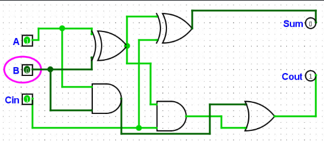

# Контрольні запитання та ДЗ
## Відповіді на контрольні запитання
### 1. Базові логічні операції та вентилі:
1.Інверсія (НЕ / NOT): перевертає біт (із 0 робить 1, із 1 робить 0). Вентиль: NOT.

2.Кон'юнкція (І / AND): дає 1 тільки тоді, коли на всіх входах одиниці. Вентиль: AND.

3.Диз'юнкція (АБО / OR): дає 1, якщо хоч на одному вході є 1. Вентиль: OR. (Ще є виключальне АБО - вентиль XOR, видає 1, коли входи різні)

### 2. Закони де Моргана та приклад:
1-й закон: НЕ (А і Б) = (НЕ А) АБО (НЕ Б)

2-й закон: НЕ (А або Б) = (НЕ А) І (НЕ Б)

Приклад: Фраза «НЕ (іде дощ І світить сонце)» - це те саме, що «НЕ іде дощ АБО НЕ світить сонце».

### 3. Різниця між ДДНФ і ДКНФ:
ДДНФ: формулу складають по одиницях (1) з таблиці (плюсують множення).

ДКНФ: формулу складають по нулях (0) з таблиці (множать додавання).

### 4. Навіщо потрібна мінімізація та її методи:
Щоб викинути зайві деталі зі схеми. Схема стає меншою, дешевшою та працює швидше.

Методи: розкривати дужки за правилами (алгебра Буля) або малювати сітку (карти Карно).

### 5. Різниця між півсуматором і повним суматором:
Півсуматор: додає тільки 2 біти (A і B).

Повний суматор: додає 3 біти (A, B плюс ще й одиничку, яка перейшла з минулого розряду Cin).

### 6. Різниця між MUX, DEMUX та дешифратором:
Мультиплексор (MUX): як перемикач - вибирає один із багатьох входів і пускає на 1 вихід («багато в один»).

Демультиплексор (DEMUX): навпаки - бере 1 вхід і направляє його на один із багатьох виходів («один у багато»).

Дешифратор: розгадує двійковий код на вході й вмикає відповідний вихід.

### 7. Кількість рядків для 5 змінних:
32 рядки. Формула проста: $2^n$. Якщо змінних 5, то $2^5 = 32$ комбінацій.

### 8. Чому в карті Карно використовують код Грея?
У коді Грея сусідні клітинки відрізняються лише одним бітом. Завдяки цьому сусідні одиниці можна легко об'єднувати в групи й спрощувати формулу.

### 9. Як алгебраїчно перевірити спрощений вираз?
Побудувати таблицю істинності для обох варіантів (відповіді мають повністю збігтися) або розкрити дужки у спрощеній формулі й повернути початковий вигляд.

## Домашнє завдання
### Завдання 1. Таблиця істинності для $F = (A \land B) \lor C$
### Завдання 1. Таблиця істинності для F = (A ∧ B) ∨ C

| A | B | C | A ∧ B | F = (A ∧ B) ∨ C |
| :-: | :-: | :-: | :-: | :-: |
| 0 | 0 | 0 | 0 | **0** |
| 0 | 0 | 1 | 0 | **1** |
| 0 | 1 | 0 | 0 | **0** |
| 0 | 1 | 1 | 0 | **1** |
| 1 | 0 | 0 | 0 | **0** |
| 1 | 0 | 1 | 0 | **1** |
| 1 | 1 | 0 | 1 | **1** |
| 1 | 1 | 1 | 1 | **1** |

### Завдання 2. Спрощення виразу $\overline{(A \lor B)} \land (A \lor B)$
За законом де Моргана розкриваємо першу дужку:$$\overline{(A \lor B)} = \bar{A} \land \bar{B}$$

Підставляємо й розкриваємо дужки:$$(\bar{A} \land \bar{B}) \land (A \lor B) = (\bar{A} \land \bar{B} \land A) \lor (\bar{A} \land \bar{B} \land B)$$

За законом протиріччя ($X \land \bar{X} = 0$):Будь-яка змінна, помножена на свою протилежність, дає 0 ($A \land \bar{A} = 0$ і $B \land \bar{B} = 0$):$$(0 \land \bar{B}) \lor (\bar{A} \land 0) = 0 \lor 0 = 0$$

Висновок: Якщо позначити дужку $(A \lor B)$ як просто змінну $X$, маємо вираз $\bar{X} \land X$. Будь-що, помножене на свою повну протилежність, завжди дає 0.

### Завдання 3. Схема та вентилі повного суматора

На наведеній схемі виходи реалізовані за допомогою таких вентилів:

На наведеній схемі виходи реалізовані за допомогою таких вентилів:

* **Вихід Sum (Сума):**
  * **Вентилі:** **2 елементи XOR** (Виключальне АБО)
  * **Як працює:** Перший вентиль XOR обробляє входи A та B (A ⊕ B). Другий вентиль XOR бере результат першого та додає до нього вхідний перенос Cin.
  * **Формула:** Sum = (A ⊕ B) ⊕ Cin

* **Вихід Cout (Перенос):**
  * **Вентилі:** **2 елементи AND** (І) та **1 елемент OR** (АБО)
  * **Як працює:** Перший вентиль AND множить входи A та B (A ∧ B). Другий вентиль AND множить результат першого XOR на Cin. Вентиль OR об'єднує їхні сигнали.
  * **Формула:** Cout = (A ∧ B) ∨ ((A ⊕ B) ∧ Cin)
