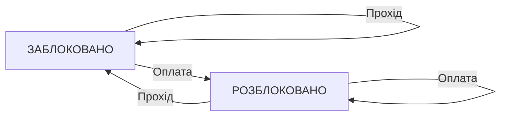

# Контрольні запитання та Домашнє завдання
## Відповіді на контрольні запитання
### 1. Комбінаційна чи Послідовнісна схема?
Комбінаційна (без пам'яті): як звичайний дверний дзвінок. Тиснеш кнопку - дзвонить. Відпустив - одразу мовчить. Вона не пам'ятає минулого.

Послідовнісна (з пам'яттю): як кнопочний вмикач світла. Натиснув один раз - світло горить і пам'ятає свій стан навіть після того, як ти прибрав палець.

### 2. Чому JK-тригер кращий за RS-тригер?
RS-тригер має «небезпечний» режим: якщо натиснути дві кнопки одночасно, він плутається і ламається (заборонений стан).

JK-тригер розумніший: якщо натиснути дві кнопки одночасно, він просто перекликне світло на протилежне (як кнопка на пульті). У ньому немає заборонених команд.

### 3. Синхронізація: за рівнем чи за фронтом?
За рівнем: двері відкриті весь час, поки горить зелене світло.

За фронтом: як спалах фотоапарата - схема робить «знімок» даних тільки в одну коротченку частку секунди, коли світло тільки-тільки перемикається з червоного на зелене.

### 4. Паралельний чи Зсувний регістр?
Паралельний: 4 пасажири забігають у вагон одночасно через 4 різні двері.

Зсувний: 4 пасажири заходять у вагон по черзі один за одним через одні єдині двері.

### 5. Автомат Мура чи Мілі?
Мур: реакція залежить тільки від того, де ми знайдемося. (Світлофор: якщо горить червоний - усі стоять, що б ти не робив).

Мілі: реакція залежить і від місця, і від дії прямо зараз. (Кодовий замок: двері відкриються тільки якщо ти в потрібному меню і натиснув правильну кнопку).

### 6. Приклад у програмуванні
Музичний плеєр у телефоні:
Стан 1: Пауза. Натиснули кнопку $\to$ перейшов у Стан 2: Грає.

Стан 2: Грає. Натиснули кнопку $\to$ повернувся в Стан 1: Пауза.

### 7. Скільки треба тактів (кроків)?
Паралельний: 1 крок, бо всі 4 біти залітають одночасно.

Зсувний: 4 кроки, бо біти заходять по черзі один за одним.

### 8. Лічильник M=6
3-бітний лічильник рахує від 0 до 7 (всього 8 чисел). Нам треба, щоб він рахував тільки до 5 (модуль 6).
Тому ми ставимо «охорожця» (додатковий вентиль AND): як тільки з'являється число 6, охоронець миттєво дає ляпаса лічильнику і скидає його на 0.

### 9. Кодовий замок (A $\to$ A $\to$ B)
1.Замок закритий.

2.Ввели A $\to$ замок запам'ятав 1-шу букву.

3.Ввели A $\to$ замок запам'ятав 2-гу букву.

4.Ввели B $\to$ ДВЕРІ ВІДКРИЛИСЯ!

## Домашнє завдання
### Завдання 1. Таблиця JK-тригера
## Домашнє завдання

### Завдання 1. Таблиця переходів JK-тригера

| J | K | Поточний стан (Q) | Наступний стан (Q_next) | Режим роботи |
| :-: | :-: | :-: | :-: | :--- |
| **0** | **0** | Q | **Q** | Збереження (стан не змінюється) |
| **0** | **1** | Q | **0** | Скидання (Reset) |
| **1** | **0** | Q | **1** | Установка (Set) |
| **1** | **1** | Q | **Q̅** | Перемикання (Toggle) |

**Чому JK-тригер універсальний:**
* У ньому немає «небезпечних» або заборонених комбінацій входів (на відміну від RS-тригера, де одночасна подача 1 і 1 викликає помилку).
* На його основі можна легко зібрати будь-який інший тригер (RS, T або D).

### Завдання 2. Турнікет у метро

### Опис переходів:

У стані ЗАБЛОКОВАНО:

Подія Прохід → залишає в стані ЗАБЛОКОВАНО (турнікет закритий).

Подія Оплата → переводить у стан РОЗБЛОКОВАНО.

У стані РОЗБЛОКОВАНО:

Подія Прохід → повертає в стан ЗАБЛОКОВАНО (людина пройшла).

Подія Оплата → залишає в стані РОЗБЛОКОВАНО.

### Тип автомата: Автомат Мура.
Обґрунтування: Стан проходу (відкрито чи закрито) повністю визначається тим, у якому стані перебуває система (ЗАБЛОКОВАНО чи РОЗБЛОКОВАНО), а не самою вхідною подією в момент її настання.

### Завдання 3. 4-бітний паралельний регістр на D-тригерах

#### Як побудувати:
1. Взяти 4 D-тригери (D0, D1, D2, D3).

2. З'єднати всі їхні входи тактування (CLK) в один спільний дріт.

3. На входи D кожного тригера подати відповідний біт 4-бітного числа (D0, D1, D2, D3).

4. Виходи Q кожного тригера утворять 4-бітний вихід регістра (Q0, Q1, Q2, Q3).

Різниця з 4-бітним зсувним регістром:

Паралельний регістр: записує та видає все 4-бітне слово одночасно за 1 такт годинника (CLK).

Зсувний регістр: передає біти послідовно один за одним через один вхід, тому для запису того самого 4-бітного слова знадобиться 4 такти CLK.